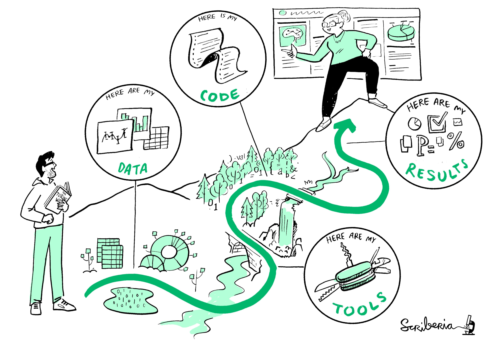

```{r setup, include=FALSE}
options(htmltools.dir.version = FALSE)
knitr::opts_chunk$set(
  fig.retina=3,
  out.width = "50%",
  cache = FALSE,
  echo = FALSE,
  message = FALSE, 
  warning = FALSE,
  hiline = TRUE
)
```

```{r xaringan-themer, include=FALSE, warning=FALSE}
library(xaringanthemer)
xaringanExtra::use_clipboard()
xaringanExtra::use_panelset()

library(quanteda)
require(quanteda.textstats)
require(quanteda.textplots)
require(quanteda.corpora)
require(quanteda.textmodels)
library(kableExtra)

source("code/helpers.R")
```


# Contenidos

- Introducción

- Flujo de un proyecto de *machine learning*

--

**Objetivo de la clase:**

Revisar un flujo estándar de *machine learning*

--

**Plan**: Primer bloque será expositivo. En el segundo bloque pondremos en práctica los conceptos

---

# Motivación


.center[

]

### La directora está preocupada por la deserción de estudiantes en su colegio

--

### Necesita anticipar cuáles son los estudiantes que podrían desertar 


---

# Los datos

La directora cuenta con **datos históricos** de deserción de su colegio

--

Para cada estudiante contamos con: 

- Información sociodemográfica
- Información socioeconómica de su hogar
- Rendimiento escolar histórico
- Situación de deserción


---


.center[

]


---

## Resultado

.panelset[
.panel[.panel-name[resultado]

### Creamos un modelo de *machine learning* para predecir la probabilidad de deserción

.center[

]
]

.panel[.panel-name[predicción 1]

Caso 1: 

- **sexo**: mujer
- **edad**: 15
- **hijos**: sí
- **rendimiento**: bajo
- **índice socioeconómico**: bajo
- **otras variables** 

**Probabilidad deserción**: 60%  

]

.panel[.panel-name[predicción 2]

Caso 2: 

- **sexo**: hombre
- **edad**: 15
- **hijos**: no
- **rendimiento**: bajo
- **índice socioeconómico**: bajo
- **otras variables** 

**Probabilidad deserción**: 30%  

]

.panel[.panel-name[programa]

La directora está muy feliz con los resultados y comenzará un programa focalizado 

La directora intervendrá en los estudiantes que tienen una mayor probabilidad de deserción  


### ¿Cómo saber que el modelo funcionará bien con los datos nuevos?

]


]


---
class: inverse center middle

# Vamos desde el principio

---

## Algunas ideas

- Programa que aprenda patrones sin que las reglas sean declaradas explícitamente 

--

- *Aprendizaje* a partir de una muestra, para luego predecir sobre datos nuevos

--


.center[

]

### La gran incógnita: ¿cómo saber si nuestro modelo funcionará bien con datos nuevos?  

---

## Flujo estándar

Exploración de los datos

--

Separar el set de datos en al menos 2 partes (deberían ser 3)

- set de entrenamiento (*training set*)
- set de testeo (*test set*)

--

Entrenar el algoritmo en el set de entrenamiento 
- *Cross validation*
- Ajuste de hiperparámetros

--

Probar el resultado en el set de validación

- *Accuracy*
- *Precision*
- *Recall*
- *F1-score*

---

<br>
<br>
<br>
<br>
<br>

.center[
# Revisaremos este flujo con el dataset Titanic
]

 

---

## Antes de seguir...

```{r, eval=F}
install.packages("tidyverse")
install.packages("caret")
install.packages("pROC") # no es tan importante

```

Tengan los datos a mano
- Titanic
- Encuesta de Presupeustos Familiares (EPF)

Ejecuten el código con las funciones que les compartí en el archivo helpers.R


---

## Los datos

```{r}
library(tidyverse)
titanic <- read_csv("data/titanic.csv")
```

```{r}
names(titanic)
```

```{r, fig.width=5, fig.height=4, fig.align='center'}
library(tidyverse)

titanic %>% 
  count(Survived) %>%
  mutate(Survived = as.factor(Survived)) %>% 
  ggplot(aes(x = Survived, y = n, fill = Survived )) +
  geom_bar(stat = "identity") +
  theme_bw() +
  theme(legend.position = "none")

```


---

## Exploración

.panelset[
.panel[.panel-name[sexo]

```{r, fig.width=5, fig.height=4, fig.align='center'}
library(tidyverse)

titanic %>% 
  mutate(Survived = as.factor(Survived)) %>% 
  group_by(Sex, Survived) %>% 
  summarise(frecuencia = n()) %>% 
  group_by(Sex) %>% 
  mutate(porcentaje = frecuencia / sum(frecuencia)) %>% 
  ggplot(aes(x = Sex, y = porcentaje, fill = Survived )) +
  geom_bar(stat = "identity", position = "dodge") +
  theme_bw() 

```


]

.panel[.panel-name[clase]

```{r, fig.width=5, fig.height=4, fig.align='center'}

titanic %>% 
  mutate(Survived = as.factor(Survived)) %>% 
  group_by(Pclass, Survived) %>% 
  summarise(frecuencia = n()) %>% 
  group_by(Pclass) %>% 
  mutate(porcentaje = frecuencia / sum(frecuencia)) %>% 
  ggplot(aes(x = Pclass, y = porcentaje, fill = Survived )) +
  geom_bar(stat = "identity", position = "dodge") +
  theme_bw() 

```

]

.panel[.panel-name[edad-precio]

```{r}
titanic %>% 
  mutate(Survived = as.factor(Survived)) %>% 
  group_by(Survived) %>% 
  summarise(media_edad = mean(Age),
            media_precio = mean(Fare)) %>% 
  kbl() %>% 
  kable_styling()
```


```{r, fig.width=6.5, fig.height=4, fig.align='center'}
titanic %>% 
  mutate(Survived = as.factor(Survived)) %>% 
  mutate(Age = if_else(Age < 1, 0, Age),
         edad_tramo =cut(Age, breaks= seq(-1,max(Age) + 4, 5))
         ) %>%
  group_by(Survived, edad_tramo) %>% 
  summarise(frecuencia = n()) %>% 
  group_by(edad_tramo) %>% 
  mutate(porcentaje = frecuencia / sum(frecuencia ) * 100) %>% 
  filter(Survived == 1) %>% 
  ggplot(aes(x = edad_tramo, y = porcentaje, group = 1)) +
  geom_line() + 
  theme_bw()
```


]

.panel[.panel-name[hijos-padres]

Número de padres-hijos a bordo

```{r, fig.width=5, fig.height=3.8, fig.align='center'}

titanic %>% 
  count(`Parents/Children Aboard`, Survived) %>% 
  group_by(`Parents/Children Aboard`) %>% 
  mutate(porcentaje = n / sum(n),
         Survived = as.factor(Survived)) %>% 
  ggplot(aes(x = `Parents/Children Aboard`, y = porcentaje, fill = Survived )) +
  geom_bar(stat = "identity", position =  position_dodge2(preserve = "single")) +
  theme_bw() 

  
```


]

.panel[.panel-name[hermanos-pareja]

Número de hermanos-pareja a bordo

```{r, fig.width=5, fig.height=3.8, fig.align='center'}

titanic %>% 
  count(`Siblings/Spouses Aboard`, Survived) %>% 
  group_by(`Siblings/Spouses Aboard`) %>% 
  mutate(porcentaje = n / sum(n),
         Survived = as.factor(Survived)) %>% 
  ggplot(aes(x = `Siblings/Spouses Aboard`, y = porcentaje, fill = Survived )) +
  geom_bar(stat = "identity", position =  position_dodge2(preserve = "single")) +
  theme_bw() 

  
```

]
]

---

## Extracción de características 

Crear variables *dummy* y eliminar columnas 

```{r, echo=TRUE}
library(fastDummies)
library(janitor)
titanic2 <- dummy_cols(titanic, select_columns = c("Pclass", "Sex")) %>% 
  select(-c("Sex", "Name", "Pclass")) %>% 
  clean_names()

titanic2 <- titanic2 %>% 
  mutate_at(vars("age", "fare", "siblings_spouses_aboard", "parents_children_aboard"), 
            .funs = list(~(. - mean(.) ) / sd(.) )) %>% 
  select(-c("pclass_1", "sex_female"))


```


---

## Separar en dos partes

```{r, echo=TRUE}
library(caret)
set.seed(123)
train_indices <- createDataPartition( titanic2$survived, times = 1, p = 0.8, list = FALSE)
train_set <-  titanic2[train_indices, ]
test_set <-  titanic2[-train_indices, ]

```


--

.pull-left[
```{r}
train_set %>% 
  count(survived) %>% 
  mutate(porcentaje = n / sum(n)) %>% 
  kbl(caption = "Train") %>% 
  kable_styling()
```

<br>

```{r}
test_set %>% 
  count(survived) %>% 
  mutate(porcentaje = n / sum(n)) %>% 
  kbl(caption = "Test") %>% 
  kable_styling()

```


]

--

.pull-right[

```{r}
titanic2 %>% 
  count(survived) %>% 
  mutate(porcentaje = n / sum(n)) %>% 
  kbl(caption = "Total") %>% 
  kable_styling()

```

### ¿Cuál es la importancia de esta partición?

]


---

## Proceso de entrenamiento

```{r, echo=TRUE}
# Ajuste de una regresión logística
model <- glm(formula = survived ~ sex_male + pclass_2 + pclass_3 + age + fare +
             siblings_spouses_aboard + parents_children_aboard,
             family = "binomial",
    data = train_set)

# Predicción en el set de entrenamiento
predict_reg1 <- predict(model, train_set, type = "response")

# Predicción en el set de testeo
predict_reg2 <- predict(model, test_set, type = "response")

# Definición de un umbral. Usamos 0.5
predictions_train <- if_else(predict_reg1 > 0.5, 1, 0)
predictions_test <- if_else(predict_reg2 > 0.5, 1, 0)

# Calculamos el porcentaje de acierto en cada uno de los conjuntos
acc_train <- mean(train_set$survived == predictions_train)
acc_test <- mean(test_set$survived == predictions_test)

print(paste("acc train: ", acc_train) )
print(paste("acc test: ", acc_test) )


```


---

## ¿Qué hubiera ocurrido con otra partición?

--

## ¿El resultado hubiese sido el mismo?


--

## Repitamos el proceso con otra muestra

```{r, echo=TRUE}
library(caret)
set.seed(123456)
train_indices <- createDataPartition( titanic2$survived, times = 1, p = 0.8, list = FALSE)
train_set <-  titanic2[train_indices, ]
test_set <-  titanic2[-train_indices, ]
```


```{r, echo=FALSE}
model <- glm(formula = survived ~ sex_male + pclass_2 + pclass_3 + age + fare +
             siblings_spouses_aboard + parents_children_aboard,
             family = "binomial",
    data = train_set)

predict_reg1 <- predict(model, train_set, type = "response")

predict_reg2 <- predict(model, test_set, type = "response")


predictions_train <- if_else(predict_reg1 > 0.5, 1, 0)
predictions_test <- if_else(predict_reg2 > 0.5, 1, 0)

acc_train <- mean(train_set$survived == predictions_train)
acc_test <- mean(test_set$survived == predictions_test)

print(paste("acc train: ", acc_train) )
print(paste("acc test: ", acc_test) )

```

## Nuestra predicción tiene varianza


---

## Cross validation

```{r, echo=TRUE}
library(caret)
set.seed(12345)
train_control <- trainControl(method = "cv", number = 10, savePredictions = TRUE)

crossval <- train(as.factor(survived) ~ sex_male + pclass_2 + pclass_3 + age + fare +
             siblings_spouses_aboard + parents_children_aboard ,
             data = train_set ,
             method = "glm",
             family=binomial(),
             trControl = train_control)

    


```
  

```{r, echo=FALSE}
crossval$resample %>% 
  select(-Kappa) %>% 
  kbl() %>% 
  kable_styling()

print(paste("mean acc:", round(mean(crossval$resample$Accuracy), 4)))

```
 
---

## ¿Qué tan bueno es nuestro clasificador?

--

### ¿~80% de acierto es suficiente?

--

### ¿80% comparado con qué?


---

## Modelo base

```{r, fig.width=5, fig.height=3.8, fig.align='center'}
titanic %>% 
  count(Survived) %>%
  mutate(Survived = as.factor(Survived),
         porcentaje = round(n / sum(n) * 100, 2)
         ) %>% 
  ggplot(aes(x = Survived, y = porcentaje, fill = Survived )) +
  geom_bar(stat = "identity") +
  geom_text(aes(label=porcentaje), vjust=-0.25) +
  theme_bw() +
  theme(legend.position = "none")
```

--

### Sin saber *machine learning*, podemos obtener un acierto de más de 61%

---

## Modelo base

### ¿Qué pasaría si la relación de las clases fuera 99% y 1%?

--

### ¿Es suficiente la medida de *accuracy*?

--

### En clasificaciones desbalanceadas se requieren más métricas


---

## Matriz de confusión

```{r, echo=TRUE}
confusion <- data.frame(real = test_set$survived, pred = predictions_test)
table(confusion$real, confusion$pred)
```
### En el mundo ideal solo tendríamos valores en la diagonal

Matriz de confusión

- verdadero negativo (superior izquierdo)
- verdadero positivo (inferior derecho)
- falso positivo (superior derecho)
- falso negativo (inferior izquierdo)


---

## Precision y recall

.panelset[
.panel[.panel-name[precision]

$precision = \frac{VP}{VP + FP}$ 

$precision = \frac{56}{56 + 15}$

Cuando el modelo predice sobrevivencia, acierta en el ~79% de los casos

.center[

]


]

.panel[.panel-name[recall]


$recall = \frac{VP}{VP + FN}$

$recall = \frac{56}{56 + 19}$

El modelo identifica correctamente el 75% de los sobrevivientes. Identifica 3 de cada 4 sobrevivientes

.center[

]


]

.panel[.panel-name[síntesis]

### ¿Qué es más valioso? ¿identificar los positivos (sobreviviente) o los negativos (fallecido)?

### Dependerá del problema
- Predicción de *spam*
- Fraude bancario
- Otorgamiento de crédito

]


]


---

## Experimento

### Cambiemos el umbral de 0.5 y veamos qué pasa


```{r, eval=FALSE, echo=TRUE}
predictions_test <- if_else(predict_reg2 > 0.8, 1, 0)
```


```{r}
predictions_test <- if_else(predict_reg2 > 0.8, 1, 0)
acc_test <- mean(test_set$survived == predictions_test)
confusion_2 <- data.frame(real = test_set$survived, pred = predictions_test)

table(confusion$real, confusion$pred)
table(confusion_2$real, confusion_2$pred)
```

### Bajaron los falsos positivos y aumentaron los falsos negativos

--

### ¿Estoy mejor o peor que antes?


---

## Experimento


```{r calcular valores acc1, echo=FALSE, fig.align='center', fig.width=5, fig.height=3.2}

calcular_acc <- function(umbral, predicciones, test_data) {
  predictions_test <- if_else(predicciones > umbral, 1, 0)
  return(mean(test_data == predictions_test)) 
}

acc_values <- map_dbl(seq(0.1, 0.9, 0.05), ~calcular_acc(.x, predict_reg2, test_set$survived) )
df <- data.frame(acc = acc_values, thresholds = seq(0.1, 0.9, 0.05)) 
max_acc = df %>% filter(acc == max(acc)) %>% pull(thresholds)


```


.panelset[


.panel[.panel-name[umbrales]

```{r, echo=T}
acc_08 <- as.character(round(mean(confusion_2$real == confusion_2$pred), 2))
acc_05 <-  as.character(round(mean(confusion$real == confusion$pred), 2))
```
El *accuracy* para el umbral de 0.5 es `r acc_05`

El *accuracy* para el umbral de 0.8 es `r acc_08`


```{r, echo=FALSE, fig.align='center', fig.width=5, fig.height=2.8}
df %>% 
  ggplot(aes(x = thresholds, y = acc, group = 1)) +
  geom_line() +
  geom_vline( xintercept = max_acc ) +
  theme_bw() +
  annotate("text",  x = max_acc + 0.05, y = 0.75, label = round(max(df$acc), 2) )

```


]

.panel[.panel-name[código-umbrales]


```{r calcular valores acc2, echo=TRUE, eval=FALSE, fig.align='center', fig.width=5, fig.height=3.2}

calcular_acc <- function(umbral, predicciones, test_data) {
  predictions_test <- if_else(predicciones > umbral, 1, 0)
  return(mean(test_data == predictions_test)) 
}

acc_values <- map_dbl(seq(0.1, 0.9, 0.05), ~calcular_acc(.x, predict_reg2, test_set$survived) )
df <- data.frame(acc = acc_values, thresholds = seq(0.1, 0.9, 0.05)) 
max_acc = df %>% filter(acc == max(acc)) %>% pull(thresholds)

df %>% 
  ggplot(aes(x = thresholds, y = acc, group = 1)) +
  geom_line() +
  geom_vline( xintercept = max_acc ) +
  theme_bw() +
  annotate("text",  x = max_acc + 0.05, y = 0.75, label = round(max(df$acc), 2) )

```


]
]


---

## ¿Cómo se ve nuestra matriz de confusión?

```{r, echo=TRUE}
predictions_test_055 <- if_else(predictions_test > max_acc, 1, 0)
confusion_055 <- data.frame(real = test_set$survived, pred = predictions_test_055)
table(confusion_055$real, confusion_055$pred)
```


Estamos prediciendo valor 1 cuando estamos bastante seguros

### ¿Es suficiente el *accuracy*?

**A considerar:**

- Tenemos muy pocos falsos positivos (buen *precision*)
- Aumentamos los falsos negativos (mal *recall*)

Ambas medidas están en tensión: al subir una, generalmente baja la otra


---

## Curva ROC


$True \; positive \; rate \; (TPR) = \frac{True \; positives\; (TP)}{True\;positives\;(TP)\;+\; False\;negatives (FN)}$

$False \; positive\;rate\;(FPR) = \frac{False\;positives\;(FP)}{False\;positives\;(FP)\;+\;True\; negatives\;(TN)}$

--

### Podemos calcular TPR y FPR para muchos umbrales de predicción

---

## Curva ROC

.panelset[
.panel[.panel-name[curva-roc]


```{r, fig.align='center', fig.width=5, fig.height=3.2, echo=T}
set.seed(1234)
umbrales <- runif(n = 200) # números random

# Calculamos 200 matrices de confusión
confusion_list <-  map(umbrales, ~get_confusion_matrix(.x, predict_reg2, test_set$survived))    

# Calculamos tpr y fpr para cada una de las matrices
tpr_list <- map_dbl(confusion_list, get_tpr)
fpr_list <- map_dbl(confusion_list, get_fpr)

# Graficamos los resultados
roc_df <- data.frame(tpr = tpr_list, fpr = fpr_list, threshold = umbrales) %>% 
  mutate(threshold2 = 1 - threshold) %>% 
  arrange(fpr, threshold2) 
roc_df %>% 
  ggplot(aes(x =  fpr , tpr  , group = 1 )) +
  geom_line() +
  geom_abline() +
  theme_bw()

```

]

.panel[.panel-name[codigo-anexo]
```{r, eval=FALSE, echo=TRUE}

get_confusion_matrix <- function(umbral, predicciones, test_data) {
  
  predictions_test <- if_else(predicciones >= umbral, 1, 0) 
  df <- data.frame(real = test_set$survived, pred = predictions_test)
  confusion <- table(df$real, df$pred)
  
  
  # Si solo hay predicciones positivas
  if (sum(df$pred == 1 ) == nrow(df) ) {
        `0` = c(0, 0)
        return (cbind(`0`, confusion)) 
    # Si solo hay predicciones negativas
  } else if (sum(df$pred == 0 ) == nrow(df)) {
      `1` = c(0, 0)
      return(cbind(confusion,   `1`))
  } else {
    return(confusion)
  }
  
}


get_tpr <- function(confusion) {
  tp = confusion[2, 2]  
  fn = confusion[2, 1]
  tp / (tp + fn)
}

get_fpr <- function(confusion) {
  fp = confusion[1, 2]
  tn = confusion[1 ,1]
  fp / (fp + tn)

}

```
]
]

---

## Curva roc en fácil

Con el paquete pROC es mucho más sencillo

```{r, echo=TRUE, eval=TRUE, fig.width=5, fig.height=3.2, fig.align='center'}
library(pROC)
sim_roc <- roc(response = test_set$survived,
               predictor = predict_reg2)

ggroc(sim_roc, legacy.axes = TRUE) +
  labs(x = 'False-positive rate', y = 'True-positive rate', title = 'Simulated ROC curve')


```


---

## F1-score

**Podemos evaluar conjuntamente precision y recall**

**Precision y recall pesan los mismo**

$F_1 = 2 \frac{precision \cdot recall}{precision + recall}$

--

**recall es considerado** $\beta$ **veces más importante que precision**

$F_{\beta} =  \frac{precision \cdot recall}{(\beta^2 \cdot precision) + recall}$

--

**En general, consideramos que pesan lo mismo**

--

F1 está definido entre 0 y 1


---
<br>
<br>

## Demos unos pasos atrás

--

## Queremos que nuestro algoritmo aprenda y sea capaz de generalizar

--

### Dos problemas
- *overfitting* (sobre ajuste)
- underfitting (bajo ajuste)

---

## Overfitting


.panelset[
.panel[.panel-name[xgboost]
Usaremos un algoritmo llamado *extreme gradient boosting* (xgb) 

[Aquí](https://xgboost.readthedocs.io/en/stable/jvm/index.html) pueden encontrar documentación sobre implementaciones en varios lenguajes

- python
- R
- C++
- Julia
- Ruby

]
.panel[.panel-name[entrenamiento]

Entrenamos con árboles de mucha profundidad y usamos muchas rondas

```{r, eval=TRUE, echo=TRUE}
library(xgboost)
# Variables que participan en el modelo 
covariables <- c("sex_male", "pclass_2", "pclass_3", "age", "fare", "siblings_spouses_aboard", "parents_children_aboard")

# Formato eficiente
dtrain <- xgb.DMatrix(data = train_set %>% select(all_of(covariables)) %>% as.matrix(),
                      label = train_set$survived)

# Entrenamiento
model_xgb <- xgboost(
  data = dtrain,
  nrounds = 60, 
  max.depth = 18, 
  objective = "binary:logistic", 
  verbose = F)


```


]

.panel[.panel-name[acc-train]

```{r, echo=T}
predict_xgb_train <- predict(model_xgb, dtrain)
predictions_train <- if_else(predict_xgb_train > 0.5, 1, 0)
acc_train <- mean(train_set$survived == predictions_train)
print(sprintf("acc en test set: %s", round(acc_train, 3)) )


```

]

.panel[.panel-name[acc-test]

```{r, echo=TRUE}
predict_xgb_test <- predict(model_xgb, test_set %>% select(all_of(covariables)) %>% as.matrix())
predictions_test <- if_else(predict_xgb_test > 0.5, 1, 0)
acc_test <- mean(test_set$survived == predictions_test)
print(sprintf("acc en test set: %s", round(acc_test, 3)) )

```

]

.panel[.panel-name[aprendizaje]

Memorizar != aprender

Nuestro algoritmo se sobreajustó a un set de datos

No es capaz de generalizar adecuadamente

Se pueden ajustar los *hiperparámetros*  

]

]


---
class: inverse center middle

# Pongamos las cosas en práctica

---

## Ejercicio

Usaremos datos de la VIII Encuesta de Presupuestos Familiares. Entrenaremos un modelo para que aprenda la probabilidad de que un hogar tenga gasto en bencina.  

Realizaremos todo el flujo de un proyecto de *machine learning*

- Exploración (relación entre la variable objetivo y las covariables) (20 minutos)
- Separación train/test (10 minutos)
- Entrenamiento (incluir *cross validation*) (20 minutos)
- Evaluación en el set de testeo (10 minutos)

---

## Reseña EPF

```{r, echo=FALSE, fig.height=5, fig.align='center'}
library(feather)
gastos <-  read_feather("data/estructura_gastos.feather")

gastos %>% 
  mutate(prop = round(prop, 2)) %>% 
  ggplot(aes(d, prop, fill = d)) +
  geom_bar(stat = "identity") + 
  geom_text(aes(label=prop), vjust=-0.25) +
  labs(title = "Estructura de gastos de los hogares", subtitle = "VIII EPF") +
  theme_bw() +
  theme(legend.position = "none",
        plot.title = element_text(hjust = 0.5),
        plot.subtitle = element_text(hjust = 0.5)) 
    


```


---

class: center, middle

## Métodos Computacionales para las Ciencias Sociales

### Hasta la próxima clase


